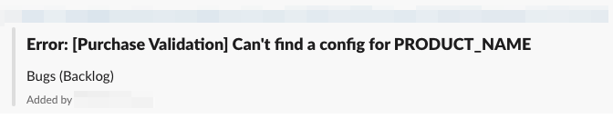

# Slack App for monday.com links unfurling using AWS Lambda & JavaScript

Slack app which creates previews of pulse & board names like this:



# Setup

* Read [Slack instructions](https://api.slack.com/reference/messaging/link-unfurling) about app creation and setup.
* Create your Slack app.
* Get your monday.com [API token](https://support.monday.com/hc/en-us/articles/360005144659-Does-monday-com-have-an-API-)
* Clone repo and create .env file:

```text
STAGE=
SLACK_VERIFICATION_TOKEN=
SLACK_CLIENT_TOKEN=
MONDAY_TOKEN=
```
where
- STAGE ('dev', 'prod' etc) used to mark a deployment type
- MONDAY_TOKEN - is your token for Monday API
- SLACK_VERIFICATION_TOKEN - the verification token from your Slack app settings 
- SLACK_CLIENT_TOKEN - the token you will get after Slack app installation (leave it empty since you will obtain it later)

* Set and deploy lambda

```text
* npm install -g serverless # setup serverless
* sls config credentials --provider aws --key xxx --secret xxx # auth to you AWS account
* npm install # setup your node project

Deploy using:
* sls deploy
Debug locally using:
* sls offline start
```

* Paste your lambda url https://your-url.amazonaws.com/your-stage/monday-app-unfurl to the Slack app event receiver form.
* Install Slack app and get User OAuth token. Paste it to .env file.
* Redeploy lambda and that's it. 


### Useful manuals and examples:
- https://hackernoon.com/informative-alerts-with-serverless-slack-unfurling-acb6457e3a59
- https://github.com/serhatcan/serverless-opsgenie-slack-alert-unfurling
- https://github.com/slackapi/sample-app-unfurls
- https://app.slack.com/block-kit-builder